<p align="center">
  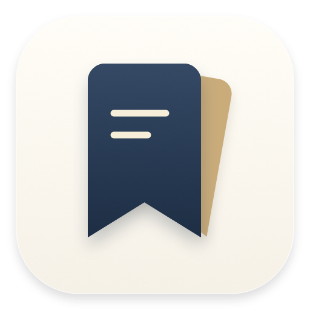
</p>

# Galpi 0.4.0

노치와 단축키로 꺼내 쓰는 개인용 Mac 메모 앱입니다. 마크다운 메모, 폴더 바로가기, 녹음, ChatGPT·Claude 회의록, 사용자 테마를 지원합니다.

**[macOS 설치 파일 다운로드 · 0.4.0 베타 (DMG)](https://github.com/JaehyunYoo/galpi/releases/download/v0.4.0/Galpi-0.4.0-universal-beta.dmg)** · [ZIP·소스·체크섬 및 변경 사항](https://github.com/JaehyunYoo/galpi/releases/tag/v0.4.0)

macOS 13 이상, Intel·Apple Silicon 공용입니다. Apple 공증 전 베타이므로 처음 실행할 때 아래의 [설치 안내](#setup)를 확인해 주세요.

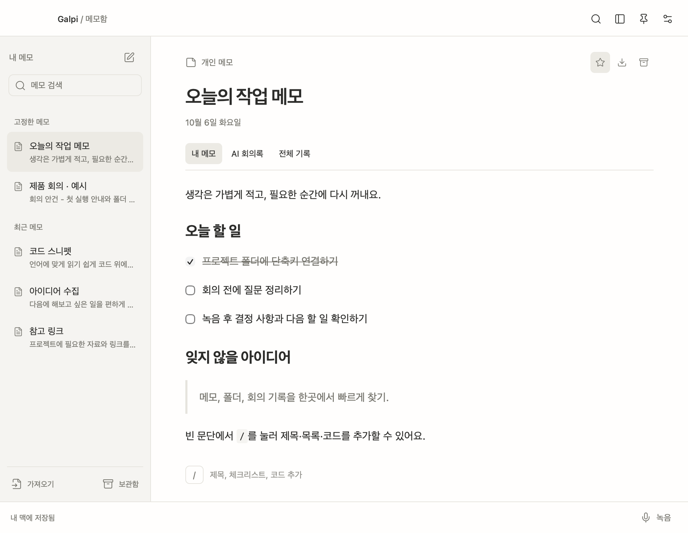

왼쪽에서 메모를 찾고, 본문에서 제목·체크리스트·코드를 작성합니다. **내 메모 · AI 회의록 · 전체 기록**은 같은 메모 안에서 탭으로 전환합니다.

이 문서의 스크린샷은 **Galpi 0.4.0의 실제 앱 UI**를 예시 데이터로 촬영했습니다. 폴더 경로와 회의 내용은 설명용이며, 회의록 화면은 실제 AI 호출 없이 넣은 예시입니다.

**현재 배포본은 macOS 13 이상을 대상으로 빌드한 Intel·Apple Silicon 공용 베타입니다.** Apple Silicon / macOS 26.3.1에서 자동 테스트를 통과했습니다. 구형 macOS와 Intel 실기기 검증, Developer ID 서명 및 Apple 공증은 아직 완료하지 않았습니다.


앱 표시 이름과 파일 이름은 모두 **Galpi**이며 한글 이름은 갈피입니다. 이전 이름은 MyCast였습니다. 기본 데이터 폴더는 `~/Library/Application Support/Galpi/`이며 개발·배포 환경 변수는 `GALPI_*`를 사용합니다. 기존 권한과 로그인을 유지하기 위해 번들 ID `com.mycast.personal`과 키체인 서비스 식별자만 호환용으로 유지합니다. 기존 ChatGPT 등록은 서비스 화면에 MyCast로 표시될 수 있으며 새 등록부터 Galpi를 사용합니다.

프로젝트 위치는 `~/Desktop/Galpi`입니다. 아래 터미널 명령은 특별한 설명이 없으면 이 폴더에서 실행합니다. 앱 사용자는 소스 코드나 개발 도구를 설치할 필요가 없습니다.

## 목차

- [설치와 첫 설정](#setup)
- [노치와 독립 메모 창](#notch)
- [메모 사용법](#notes)
- [폴더와 단축키](#shortcuts)
- [테마 설정](#themes)
- [녹음과 회의록 생성](#meetings)
- [ChatGPT·Claude 연결과 모델 설정](#chatgpt)
- [데이터 보관·백업·복원](#data)
- [개발 환경과 빌드](#build)
- [테스트용 배포](#beta)
- [Developer ID 서명과 정식 배포](#release)
- [업데이트 방법](#update)
- [문제 해결](#troubleshooting)
- [호환성과 검증 범위](#validation)
- [프로젝트 구성](#structure)

<a id="setup"></a>
## 설치와 첫 설정

### 설치

1. [Releases에서 DMG 설치 파일](https://github.com/JaehyunYoo/galpi/releases/tag/v0.4.0)을 내려받아 엽니다. 직접 빌드했다면 `dist/Galpi-0.4.0-universal-beta.dmg`를 사용합니다.
2. **Galpi.app**을 **Applications** 폴더로 드래그합니다.
3. 응용 프로그램 폴더의 **Galpi**를 실행합니다. ZIP을 받았다면 압축을 풀고 앱을 응용 프로그램 폴더로 옮깁니다.
4. 메모 창 오른쪽 위 **설정**에서 메모 단축키·노치, 폴더·단축키, AI·음성, 테마를 설정합니다.

현재 베타는 Apple 공증을 받지 않아 실행이 차단될 수 있습니다. 신뢰하는 출처에서 받은 파일이라면 한 번 실행을 시도한 뒤 **시스템 설정 → 개인정보 보호 및 보안 → 확인 없이 열기**에서 허용할 수 있습니다. 관리되는 Mac에서는 조직 정책에 따라 허용되지 않을 수 있습니다. [Apple의 앱 실행 안내](https://support.apple.com/102445)

### 먼저 해볼 것

1. 새 메모를 만들고 제목과 내용을 입력합니다. 아래에 **내 맥에 저장됨**이 표시되는지 확인합니다.
2. **Control + Option + Space (`⌃ ⌥ Space`)**로 빠른 실행창을 엽니다.
3. **설정 → 폴더·단축키**에서 자주 쓰는 폴더를 등록합니다.
4. **설정 → AI·음성 → Continue with ChatGPT**로 로그인하고 **회의록 모델**을 선택합니다.
5. 같은 화면에서 **녹음 언어**를 선택합니다. 기본값은 한국어 `ko-KR`입니다.
6. 짧은 녹음을 저장한 뒤 **AI 회의록 → 회의록 생성**을 실행합니다.

### 필요한 macOS 권한

| 기능 | 필요한 권한과 설정 |
| --- | --- |
| 대면 회의 녹음 | 개인정보 보호 및 보안 → **마이크**에서 Galpi 허용 |
| 온라인 회의 녹음 | **마이크**, **화면 및 시스템 오디오 녹음** 관련 권한 허용. macOS 버전에 따라 화면 기록 등으로 이름이 다를 수 있음 |
| 이전 macOS의 음성 변환 | 앱이 요청하면 **음성 인식** 권한 허용. 해당 기기와 언어의 로컬 인식 지원도 필요 |
| 폴더 열기 | 폴더 선택창에서 등록. macOS가 해당 위치의 접근 권한을 요청하면 확인 |
| ChatGPT 로그인 | 기본 웹 브라우저와 인터넷 연결. 인증서나 API 키를 입력하는 화면은 없음 |

권한 변경 후 macOS가 재실행을 요구하면 녹음을 저장하고 Galpi를 종료한 뒤 다시 엽니다. 온라인 녹음은 시스템 오디오를 받기 위해 화면 녹음 관련 권한을 사용하며 화면 영상은 파일로 저장하지 않습니다.

### 창 닫기와 종료

- 창의 닫기 버튼은 창을 숨깁니다. 메뉴 막대와 전역 단축키는 계속 사용할 수 있습니다.
- 창 위치는 상단 **Galpi / 메모함** 제목 영역이나 빈 공간을 드래그해 옮깁니다. 빠른 실행창도 검색란 위쪽 여백을 잡고 옮길 수 있습니다.
- 완전히 종료하려면 **Command + Q (`⌘ Q`)**를 누릅니다. 녹음 중이면 저장 후 종료할지 확인합니다.
- 앱 자체의 로그인 시 자동 실행 설정은 아직 없습니다. 자동 실행을 원하면 macOS의 로그인 항목에서 설치한 Galpi를 직접 추가합니다.

<a id="notch"></a>
## 노치와 독립 메모 창

**메모는 단축키로 바로 열고, 노치는 빠른 작업에 사용합니다.**

| 진입 방법 | 동작 |
| --- | --- |
| `⌃ ⌥ N` | 마지막 메모를 독립 창으로 열고 편집기에 포커스. 메모 창이 활성화된 상태에서 다시 누르면 저장 후 숨김 |
| `⌃ ⌥ G` 또는 화면 위의 Galpi 노치 클릭 | 최근 메모, 폴더 바로가기, 녹음 패널 열기·접기 |
| 노치의 메모 또는 **최근 메모** 선택 | 같은 독립 메모 창에서 해당 메모를 이어서 편집 |
| 노치의 **새 메모** | 새 메모를 만들고 독립 창 열기 |
| `⌃ ⌥ Space` | 기존 검색용 빠른 실행창 열기 |

**접힌 상태** — 화면 위의 Galpi를 클릭하거나 `⌃ ⌥ G`를 누르면 패널이 열립니다.


**펼친 상태** — 최근 메모, 폴더 바로가기, 녹음을 한곳에서 실행합니다.

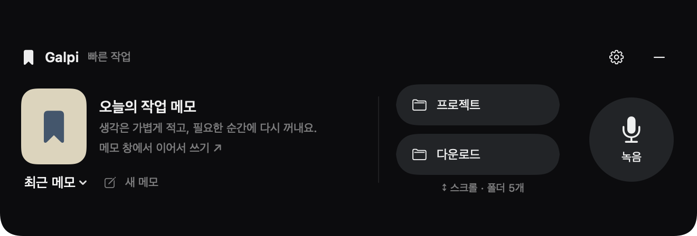

노치는 노치가 있는 내장 화면에 우선 표시합니다. 해당 화면이 없으면 주 화면 상단 중앙에 표시하고, 디스플레이 구성이 바뀌면 위치를 다시 맞춥니다. 윗부분은 카메라 영역을 비워 둡니다. 다른 앱을 클릭하거나 패널의 접기 버튼·Escape를 누르면 접힙니다.

**등록한 모든 폴더를 스크롤해서 볼 수 있습니다.** 목록은 한 번에 두 개가 보이는 높이로 표시됩니다.

1. **설정 → 폴더·단축키**에서 원하는 폴더를 등록합니다.
2. 노치를 펼치고 **가운데 폴더 버튼 위**에 포인터를 둡니다.
3. 마우스 휠이나 트랙패드 두 손가락으로 위아래 스크롤한 뒤 원하는 폴더를 클릭합니다.

폴더가 3개 이상이면 아래에 **↕ 스크롤 · 폴더 N개**가 표시됩니다. 노치 크기와 양옆의 메모·녹음 영역은 유지되고, 가운데 폴더 목록만 움직입니다.

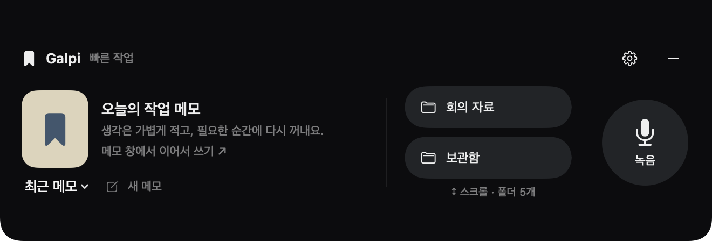

위 두 화면은 같은 폴더 5개 목록의 처음과 끝입니다. 마지막 폴더까지 스크롤하여 바로 열 수 있습니다.

노치의 **녹음**을 누른 뒤 **대면 · 마이크** 또는 **온라인 · 마이크 + 시스템**을 선택하면 화면에 표시된 메모에 녹음을 첨부합니다. 녹음 중에는 일시정지·계속 녹음·저장 후 종료가 가능하며, 접힌 노치에도 녹음 시간과 상태가 남습니다. 회의록은 해당 메모 창의 **AI 회의록** 탭에서 생성합니다.

**설정 → 폴더·단축키**에서 **메모 창 열기 / 접기**와 **노치 열기 / 접기**의 키 조합을 각각 바꿀 수 있습니다. 노치 항목의 **사용**을 끄면 노치와 전용 단축키가 함께 비활성화됩니다. 다른 기능이 기본 메모 단축키를 사용 중이면 기존 폴더 단축키를 유지하고 충돌 안내를 표시하므로 메모 단축키를 다른 조합으로 지정합니다. 메뉴 막대의 Galpi에서도 **노치 열기 / 접기**를 사용할 수 있습니다.

<a id="notes"></a>
## 메모 사용법

**새 메모**를 눌러 제목과 본문을 입력합니다. 변경 내용은 자동 저장됩니다.

| 항목 | 사용 방법 |
| --- | --- |
| 내 메모 | 직접 작성하는 메모. AI 회의록 생성으로 덮어쓰지 않음 |
| AI 회의록 | 생성된 요약·결정 사항·할 일·미결 사항. 직접 수정 가능 |
| 전체 기록 | 녹음을 글로 변환한 전사문. 외부 전사문을 붙여넣거나 오인식 수정 가능 |
| 검색 | 왼쪽 메모 검색 또는 전역 빠른 실행창 이용 |
| 메모 상단 고정 | 메모의 핀 버튼으로 목록 상단에 고정 |
| 보관·복원 | 메모 보관 버튼으로 보관함에 넣고, 보관함에서 복원 |
| 작은 창 | 상단의 메모 목록 접기 버튼으로 사이드바와 창 크기 변경 |
| 항상 위에 고정 | 상단 창 고정 버튼으로 다른 창 위에 표시 |

마크다운 입력으로 제목, 목록, 체크리스트, 인용, 코드, 링크를 작성할 수 있습니다. 빈 문단에서 `/`를 입력하고 방향키·Enter로 블록을 선택하거나 아래 **블록 추가** 버튼을 사용합니다. 본문을 선택하면 서식 도구가 나타납니다.

**코드 블록**은 키워드·문자열·숫자·주석을 다른 색으로 표시합니다. **블록 추가 → 코드**를 선택해 입력하고, 블록 위의 **코드 언어**에서 자동 감지 또는 JavaScript·TypeScript·Python·Swift·JSON·HTML·CSS·SQL 등 지원 언어를 선택합니다. **일반 텍스트**를 선택하면 색상 강조를 끕니다. 짧은 코드의 자동 감지가 부정확하면 언어를 직접 지정하세요. 라이트·다크·사용자 테마의 밝기에 맞춰 코드 색상이 바뀌며, 선택한 언어는 저장·다시 열기·마크다운 내보내기에서도 유지됩니다. 인라인 코드는 글 중간의 짧은 표현용이라 별도 언어 색상을 적용하지 않습니다. 문법 강조는 기기 안에서 처리하며 코드를 서버로 보내지 않습니다. [사용한 문법 강조 확장](https://tiptap.dev/docs/editor/extensions/nodes/code-block-lowlight)

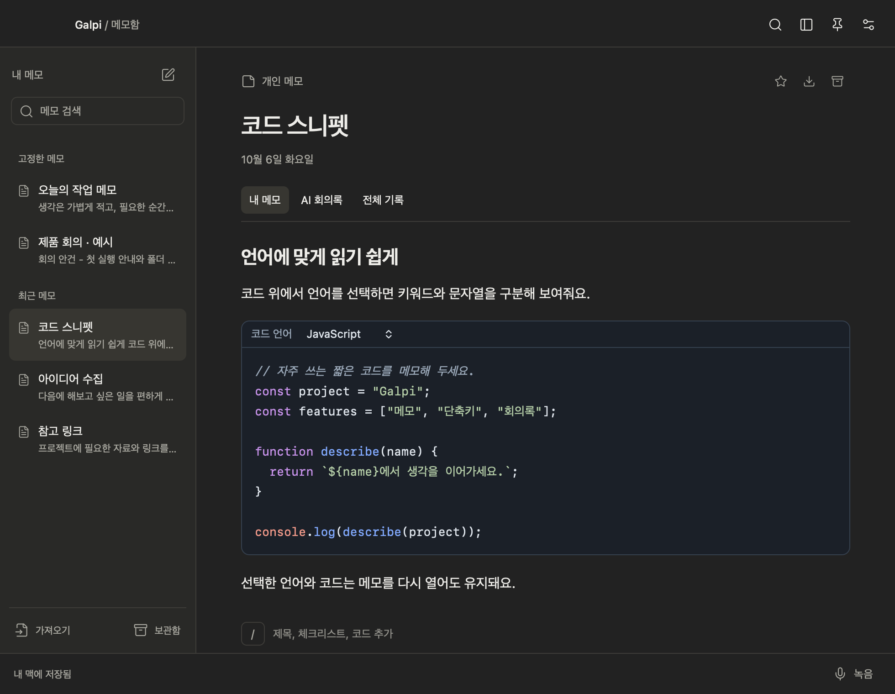

*다크 테마의 코드 메모. 코드 블록 상단에서 언어를 선택하고, 키워드·문자열·주석을 색으로 구분합니다.*

**가져오기**는 UTF-8 텍스트/마크다운 파일을 새 메모로 읽어옵니다. **마크다운 내보내기**는 현재 선택한 탭의 내용을 제목과 함께 `.md` 파일로 저장합니다. 회의록을 공유하려면 **AI 회의록** 탭을 선택한 뒤 내보내면 됩니다.

노션의 데이터베이스·협업 기능은 없으며, 표·이미지 첨부 등 지원하지 않는 마크다운 요소는 가져올 때 원본 그대로 재현되지 않을 수 있습니다.

<a id="shortcuts"></a>
## 폴더와 단축키

### 빠른 실행 단축키

기본값은 **`⌃ ⌥ Space`**입니다. **설정 → 폴더·단축키 → 빠른 실행**의 현재 키 조합을 누른 뒤 새 조합을 입력하면 변경됩니다. 설정을 취소하려면 Escape를 누릅니다.

빠른 실행창에서 메모나 등록한 폴더를 검색하고 방향키와 Enter로 선택합니다. 폴더는 Finder에서 열립니다.

### 폴더 바로가기 등록

1. **설정 → 폴더·단축키 → 폴더 추가**를 누릅니다.
2. 사용할 폴더를 선택합니다.
3. 목록에서 표시 이름을 수정할 수 있습니다. 실제 폴더 이름은 바뀌지 않습니다.
4. **단축키 지정**을 누르고 사용할 키 조합을 입력합니다.
5. **열기** 또는 지정한 단축키로 Finder에서 해당 폴더가 열리는지 확인합니다.

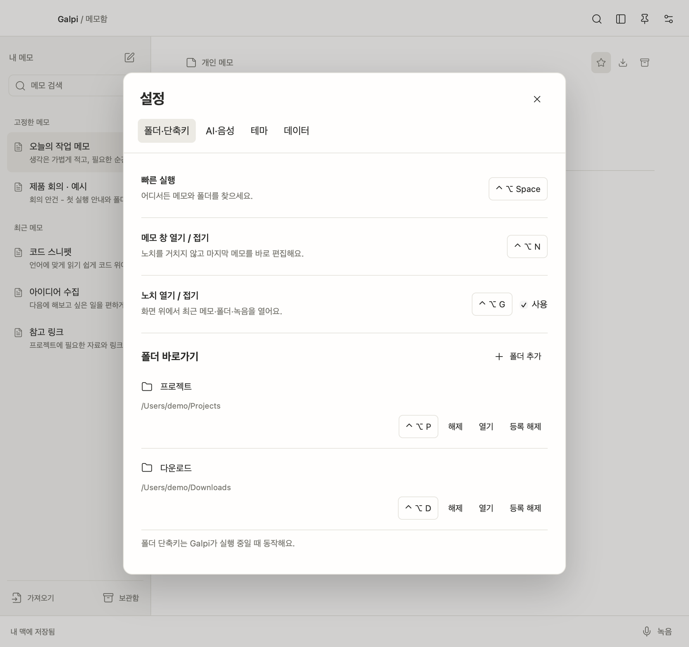

*위쪽에서 빠른 실행·메모 창·노치 단축키를 각각 설정하고, 아래쪽에서 폴더별 단축키를 설정합니다. 이미지의 `/Users/demo/…`는 예시 경로입니다.*

등록한 폴더는 [노치의 스크롤 목록](#notch)에서도 클릭하여 열 수 있습니다.

`⌘`, `⌥`, `⌃` 중 하나 이상을 포함해야 합니다. 다른 앱이나 macOS 기능이 사용하는 조합은 등록에 실패할 수 있으므로 다른 조합을 선택합니다. **해제**는 단축키만 지우고, **등록 해제**는 Galpi의 목록에서만 폴더를 제거합니다. 실제 폴더와 파일은 삭제하지 않습니다.

전역 단축키는 Galpi가 실행 중일 때 동작합니다. 이 앱의 단축키 등록 기능은 별도의 손쉬운 사용 권한을 요구하지 않습니다.

<a id="themes"></a>
## 테마 설정

**설정 → 테마**에서 **시스템 설정·라이트·다크**를 선택합니다. 메모창과 빠른 실행창에 함께 적용되고 다음 실행에도 유지됩니다.

사용자 테마는 다음 순서로 만듭니다.

1. **테마 만들기**를 누르고 이름을 입력합니다.
2. 배경·사이드바·글자·보조 글자·구분선·강조색을 지정합니다.
3. 색상 선택기 또는 `#RRGGBB` 코드로 미리보기를 조정합니다.
4. **저장하고 적용**을 누릅니다. 취소하면 이전 테마가 유지됩니다.

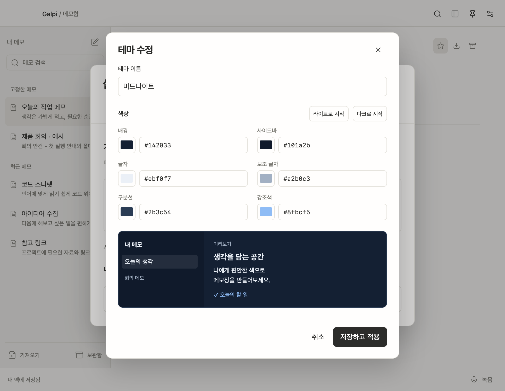

*사용자 테마 편집 화면. 여섯 가지 색을 조정한 뒤 아래 미리보기를 확인하고 저장합니다.*

저장한 테마는 수정·삭제·JSON 내보내기가 가능합니다. **가져오기**로 다른 사람이 내보낸 Galpi 테마를 추가할 수 있습니다. 적용 중인 사용자 테마를 삭제하면 해당 테마의 밝기에 맞는 기본 라이트 또는 다크로 돌아갑니다.

<a id="meetings"></a>
## 녹음과 회의록 생성

### 녹음 시작과 저장

1. 녹음을 붙일 메모를 선택하거나 새 메모를 만듭니다.
2. 하단의 **녹음**을 누릅니다.
3. **대면 회의**는 마이크만, **온라인 회의**는 마이크와 시스템 소리를 함께 녹음합니다.
4. 권한 요청을 허용하고 녹음을 시작합니다. 녹음 중 메모 작성과 일시정지가 가능합니다.
5. **종료**를 눌러 저장합니다. 녹음 중에는 해당 메모의 음성 변환·회의록 생성을 시작할 수 없습니다.
6. 메모에 붙은 녹음의 재생 버튼으로 확인합니다. 폴더 버튼으로 원본 파일 위치를 열 수 있습니다.

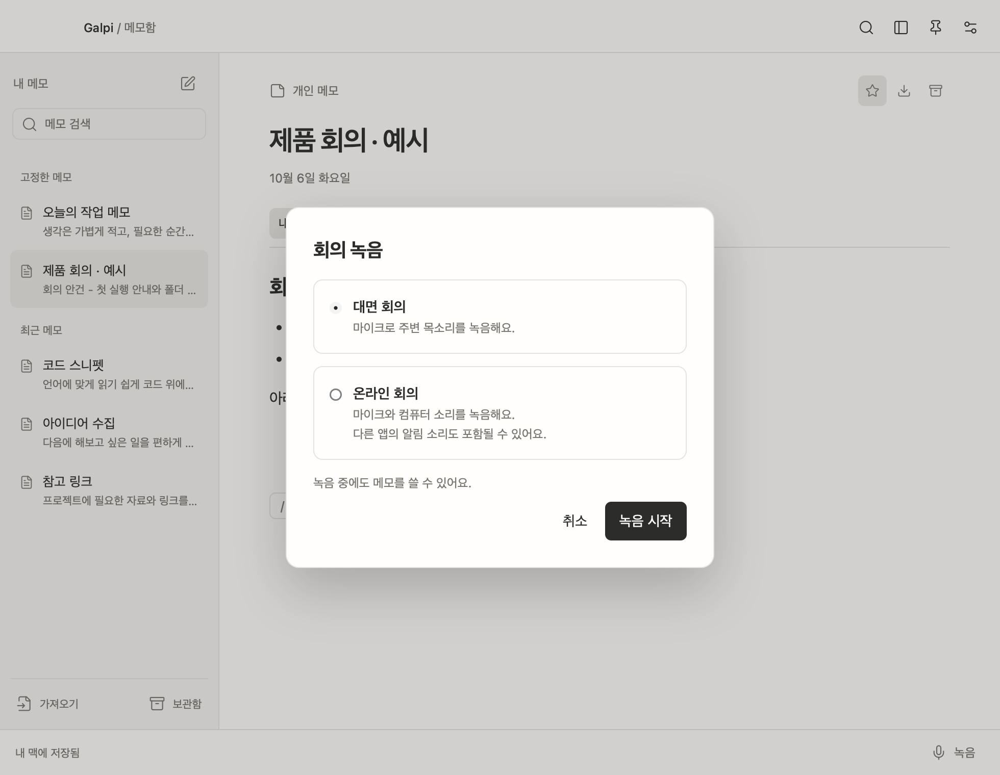

*녹음을 시작하기 전에 상황에 맞는 모드를 선택합니다. 이 화면을 여는 것만으로 녹음이 시작되지는 않습니다.*

온라인 모드에는 회의 앱 외의 음악·알림 소리도 포함될 수 있습니다. 사람별 화자 식별은 제공하지 않으며 전사문에는 **마이크 / 회의 소리**와 시각이 표시됩니다. 한 번에 하나의 녹음을 진행할 수 있습니다.

### 이미 녹음과 GPT 연결을 마쳤다면

1. **설정 → AI·음성 → 회의록 모델**을 선택합니다. 연결 후 처음 한 번은 모델 선택이 필요합니다.
2. **녹음이 붙어 있는 메모**로 돌아갑니다.
3. **AI 회의록 → 회의록 생성**을 누릅니다.

전체 기록이 비어 있으면 **로컬 음성 변환 → ChatGPT 요약**을 순서대로 진행합니다. 결과에는 핵심 요약, 결정 사항, 할 일의 담당자·기한, 미결 사항이 포함됩니다. 녹음과 언어 지원 상태에 따라 음성 변환이 먼저 실패할 수 있습니다.

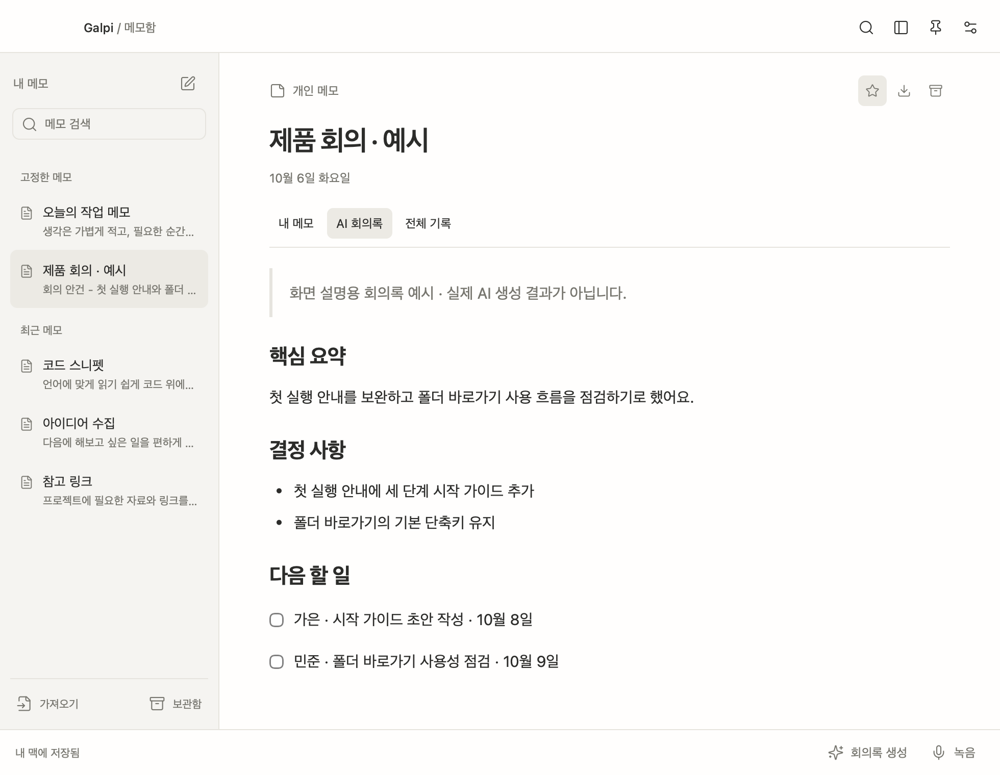

*회의록 탭의 표시 예시입니다. 화면의 내용은 문서 촬영용 샘플이며 실제 AI 생성 결과가 아닙니다. 생성한 회의록은 이 탭에서 확인·수정하고 마크다운으로 내보낼 수 있습니다.*

### 전사문을 확인하고 생성하기

1. **전체 기록 → 글로 변환**을 누릅니다.
2. 처음 사용하는 언어의 Apple 음성 인식 데이터가 필요하면 다운로드가 진행됩니다.
3. 변환된 문장을 확인하고 이름·숫자·용어 등 오인식을 수정합니다.
4. **AI 회의록 → 회의록 생성**을 누릅니다.

**전체 기록에 이미 내용이 있으면 회의록 생성은 그 내용을 사용하며 녹음을 자동으로 다시 변환하지 않습니다.** 같은 메모에 새 녹음을 추가했다면 먼저 **전체 기록 → 글로 변환**을 실행해 전사문을 갱신해야 새 발언이 반영됩니다. 이 작업은 해당 메모의 저장된 녹음을 다시 변환하므로 직접 고친 전사문이 있으면 먼저 `.md`로 내보내 보관합니다.

### 음성 변환을 지원하지 않는 Mac

외부에서 준비한 전사문을 **전체 기록**에 붙여넣고 **AI 회의록 → 회의록 생성**을 누릅니다. 이 경우 녹음 파일이 없어도 생성할 수 있습니다. 현재 앱에는 외부 음성 파일을 가져와 전사하는 기능이 없습니다.

### 다시 생성할 때

이전 AI 회의록은 `History/`에 보관한 뒤 새 결과로 바뀝니다. 생성 중 사용자가 회의록을 직접 수정하면 수정 내용을 보존하고 생성 결과를 새 메모로 저장합니다. 긴 기록은 구간별로 정리한 뒤 합쳐서 여러 번의 AI 요청이 발생할 수 있습니다. 전체 기록과 직접 쓴 메모를 함께 사용하므로 회의 목적·용어를 메모에 적어두면 도움이 됩니다.

<a id="chatgpt"></a>
## ChatGPT·Claude 연결과 모델 설정

설정의 **회의록을 만들 AI**에서 ChatGPT 또는 Claude를 선택합니다. 기존 사용자의 ChatGPT 연결과 모델은 유지되며, Claude 모델은 별도로 저장됩니다.

### ChatGPT 연결

1. **설정 → AI·음성**에서 **ChatGPT**를 선택하고 **Continue with ChatGPT**를 누릅니다.
2. 기본 브라우저에서 본인 ChatGPT 계정으로 로그인합니다.
3. 해당 계정과 워크스페이스를 확인하고 앱의 플랜 사용 권한을 승인합니다.
4. Galpi로 돌아와 연결된 계정을 확인합니다.
5. **회의록 모델**에서 사용할 모델을 선택합니다. 목록이 비어 있으면 옆의 **모델 새로고침**을 누릅니다.
6. **녹음 언어**를 실제 회의 언어에 맞춥니다. ChatGPT 모델과 음성 인식 언어는 별개의 설정입니다.

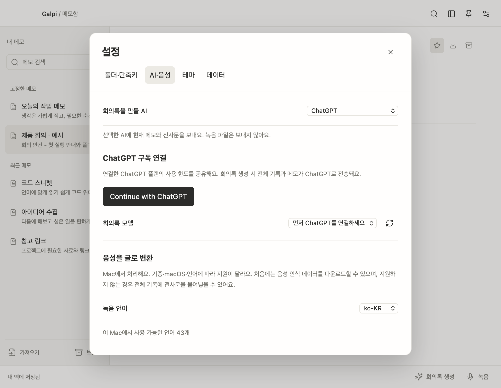

*연결 전 화면. **Continue with ChatGPT**로 로그인한 뒤 회의록 모델을 선택합니다. 하단의 녹음 언어는 음성 인식에 사용하는 별도 설정입니다.*

개인 로컬 앱용 **Sign in with ChatGPT** 방식을 사용합니다. 공식 OpenAI 문서 기준으로 이용 가능한 Plus·Pro 계정의 ChatGPT 플랜을 연결하는 흐름이며, 계정별 이용 가능 여부와 모델·한도는 서비스 상태에 따릅니다. 이 방식에는 별도 API 키나 client secret 입력이 필요하지 않습니다. [OpenAI 공식 연결 안내](https://developers.openai.com/siwc/quickstart)

### 계정 전환과 로그아웃

연결한 뒤 **다른 ChatGPT 계정 추가**로 계정을 추가할 수 있습니다. 계정 선택 목록에서 전환한 뒤 사용할 모델을 다시 선택합니다. **로그아웃**하면 현재 연결의 로컬 토큰을 지우고 원격 세션 해제를 요청합니다. 원격 해제를 확인하지 못했다는 안내가 나오면 ChatGPT 설정에서도 Galpi 연결을 해제합니다. 사용 한도와 앱 접근 권한은 ChatGPT 설정에서 확인합니다. [계정·세션 안내](https://developers.openai.com/siwc/token-sharing-open-source/profiles-and-sessions)

### Claude 연결

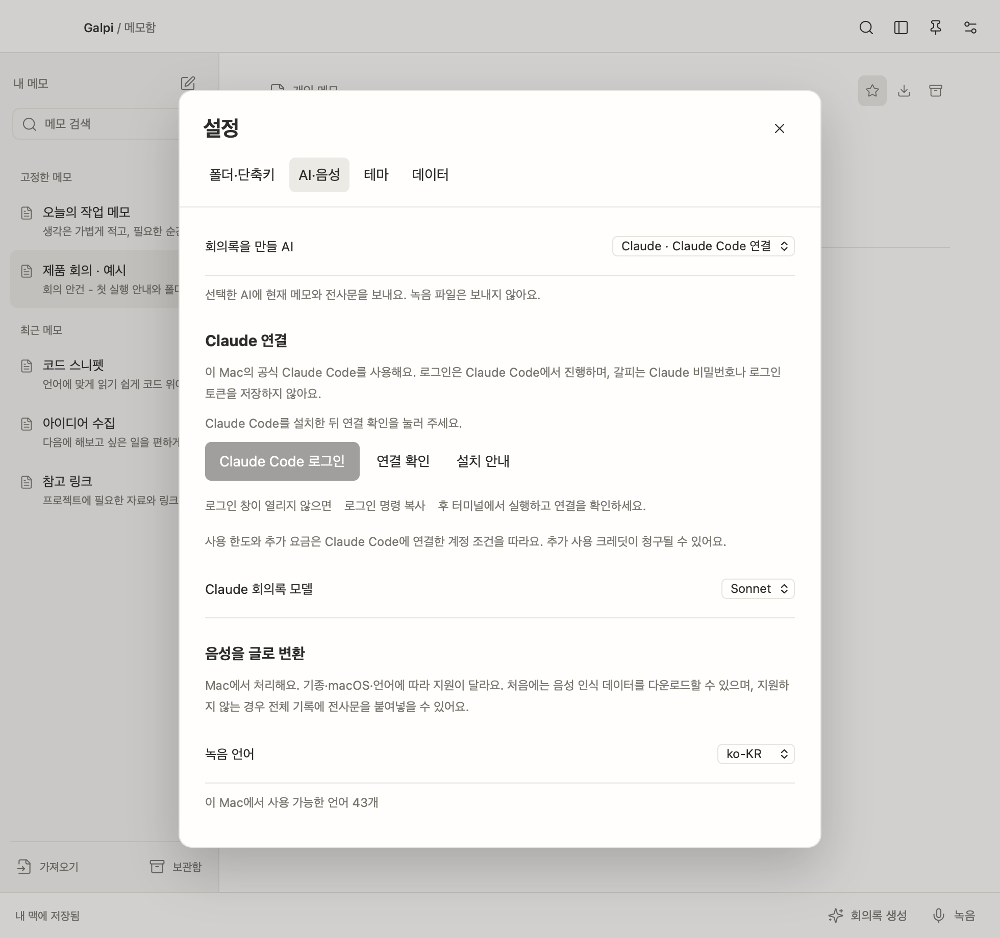

1. [Anthropic 공식 안내](https://code.claude.com/docs/en/setup)에 따라 **Claude Code**를 설치합니다. 갈피 배포 파일에는 Claude Code가 포함되지 않습니다.
2. **설정 → AI·음성 → 회의록을 만들 AI → Claude · Claude Code 연결**을 선택합니다.
3. 이미 Claude Code에 로그인되어 있으면 **연결 확인**으로 계정 상태를 확인합니다. 처음 사용한다면 **Claude Code 로그인**을 눌러 공식 브라우저 인증을 완료합니다.
4. 로그인 창이 열리지 않으면 **로그인 명령 복사**를 누르고 터미널에 붙여넣어 실행합니다. 완료 후 갈피에서 **연결 확인**을 누릅니다.
5. **Claude 회의록 모델**에서 Sonnet 또는 Opus를 선택합니다. 실제 사용 가능 모델과 사용 한도는 계정에 따릅니다.
6. 메모의 **AI 회의록 → 회의록 생성**을 누릅니다. ChatGPT로 다시 바꾸려면 AI 선택 항목만 변경합니다.

공식 Claude Code 실행 파일을 그대로 호출하며, 로그인과 계정 관리는 Claude Code에서 진행합니다. 갈피는 Claude OAuth 토큰을 읽거나 저장하지 않습니다. Claude Code를 다른 도구에서도 사용한다면 같은 로그인 상태를 공유합니다. 일반적인 설치 위치인 `~/.local/bin/claude`, `/opt/homebrew/bin/claude`, `/usr/local/bin/claude`와 앱 실행 환경의 PATH에서 실행 파일을 찾습니다.

**비용과 한도:** Claude Code에 연결한 계정과 제공자의 조건을 따릅니다. 구독 계정으로 연결해도 제3자 도구 사용에는 추가 사용 크레딧이 청구될 수 있으며, 구독에 포함된 한도만 사용한다고 보장하지 않습니다. API 또는 외부 제공자 인증이면 해당 사용량 요금이 적용될 수 있습니다. 설정에서 현재 인증 종류를 확인할 수 있습니다. [Anthropic 계정 안내](https://support.claude.com/en/articles/13189465-log-in-to-your-claude-account) · [공식 Claude Code 인증·제품 연동 안내](https://code.claude.com/docs/en/legal-and-compliance)

회의록 생성 시 메모·전사문을 표준 입력으로 전달합니다. 파일·셸 도구, MCP, 훅·스킬과 세션 저장을 끄고 빈 임시 작업 폴더에서 실행합니다. 로그인 대기는 취소할 수 있고, 응답이 실패하거나 시간 초과가 나면 기존 회의록을 유지합니다. 이 연결 방식에는 갈피에 Anthropic API 키를 직접 입력하는 UI가 없습니다.

### 어떤 데이터가 전송되나

| 데이터 | 처리·저장 위치 |
| --- | --- |
| 녹음 원본과 재생 파일 | 이 Mac의 Galpi 데이터 폴더 |
| 음성 → 글 변환 | Apple의 로컬 음성 인식. 지원하지 않으면 오류를 알리고 중단 |
| 회의 제목·내 메모·전체 기록 | 선택한 AI에 따라 OpenAI 또는 Claude Code에 연결한 서비스로 전송 |
| ChatGPT 로그인 토큰 | 이 앱에 발급된 토큰만 macOS 키체인에 보관 |
| Claude 로그인 정보 | 공식 Claude Code가 관리. 갈피는 토큰을 읽거나 저장하지 않음 |
| AI 회의록 결과 | Galpi 데이터 폴더에 저장 |

현재 구현은 음성 파일을 AI 서비스로 보내지 않습니다. 계정 연결만으로 기존 ChatGPT 대화 내용을 가져오지도 않습니다. 회의록 생성과 모델 목록 조회에는 인터넷 연결이 필요합니다.

### 서명 키와 GPT 키의 차이

| 항목 | 이 프로젝트에서의 용도 |
| --- | --- |
| OpenAI API 키 / client secret | 현재 ChatGPT 구독 연결 방식에서는 입력하지 않음 |
| Developer ID Application 인증서와 개인 키 | 제작자가 다른 Mac에 배포할 앱을 서명할 때 사용 |
| Apple Development 인증서 | 개발용이며 `release.sh`의 정식 외부 배포 인증서로 사용할 수 없음 |
| notarytool 프로필 | 제작자의 Apple 공증 인증 정보를 키체인에서 찾는 이름 |

GPT 사용자가 Apple 개발자 인증서를 만들 필요는 없습니다. 앱 제작자도 기본 테스트용 빌드에는 별도 배포 인증서 없이 임시 서명을 사용할 수 있습니다.

<a id="data"></a>
## 데이터 보관·백업·복원

기본 경로는 `~/Library/Application Support/Galpi/`입니다. **설정 → 데이터 → 데이터 폴더 열기**로 찾을 수 있습니다. 프로젝트 폴더나 앱 번들과는 다른 위치입니다.

| 파일·폴더 | 내용 |
| --- | --- |
| `library.json` | 메모, 전사문, 회의록, 등록 폴더, 단축키, 테마, 설정 |
| `library.backup.json` | 직전 저장 상태. 장기 보관용 버전 기록은 아님 |
| `Recordings/<녹음 ID>/` | 마이크·시스템 오디오 원본 CAF 및 재생용 M4A |
| `History/<메모 ID>/` | 다시 생성하기 전의 AI 회의록 |

### 백업

녹음을 종료하고 **⌘ Q**로 앱을 완전히 종료한 뒤, 데이터 폴더 전체를 날짜를 붙인 별도 위치로 복사합니다. 녹음까지 옮기려면 `library.json`만이 아니라 폴더 전체가 필요합니다. 앱 자체의 클라우드 동기화와 예약 백업 기능은 없습니다.

### 복원과 다른 Mac으로 이동

1. 대상 Mac의 Galpi를 완전히 종료합니다.
2. 대상 Mac에 데이터가 있다면 그 폴더도 먼저 별도 백업합니다.
3. 백업한 데이터 폴더를 기본 데이터 위치에 복사하고 Galpi를 실행합니다.
4. ChatGPT는 새 Mac에서 다시 연결합니다. 키체인 토큰은 데이터 폴더 백업에 포함되지 않습니다.
5. 등록 폴더의 실제 위치와 단축키 충돌을 확인하고, 필요하면 해당 폴더를 다시 등록합니다.

저장 파일이 손상되면 앱은 원본을 보존하고 시작을 멈춥니다. 손상 파일을 별도로 복사한 후 정상 백업으로 복구합니다. `library.backup.json`을 복원에 사용할 때도 앱을 종료하고 원본을 먼저 보관합니다.

비정상 종료 시 발견한 녹음 원본은 다음 실행에서 **중단됨**으로 복구합니다. 원본은 남을 수 있지만 마지막 부분·길이·트랙 간 시간 정렬은 정상 종료한 녹음과 다를 수 있습니다.

<a id="build"></a>
## 개발 환경과 빌드

### 준비

빌드는 Mac에서 수행합니다. 확인된 개발 환경은 **Xcode 26.2 / Swift 6.2.3**입니다. 전체 Xcode와 **Node.js 20 이상·npm**, 서명 배포 스크립트에서 사용하는 **ripgrep(`rg`)**이 필요합니다. 앱 실행 최소 버전인 macOS 13과 개발 도구를 설치할 수 있는 OS 버전은 다릅니다.

```sh
cd ~/Desktop/Galpi
xcode-select -p
xcrun swiftc --version
node --version
npm --version
command -v rg
```

Xcode를 처음 설치했다면 한 번 실행하여 라이선스 동의와 추가 구성 요소 설치를 마칩니다. 선택된 개발 도구가 Command Line Tools뿐이거나 다른 Xcode라면 설치 경로에 맞게 다음을 실행합니다.

```sh
sudo xcode-select --switch /Applications/Xcode.app/Contents/Developer
```

프로젝트를 처음 받았거나 의존성이 바뀌었다면 잠금 파일에 맞춰 설치합니다.

```sh
npm ci --no-audit --no-fund
```

`build.sh`도 `node_modules`가 없을 때 이를 자동 실행합니다. 이미 폴더가 있으면 자동 재설치하지 않으므로 `package-lock.json` 변경 후에는 직접 `npm ci`를 실행합니다.

### 앱 빌드와 실행

```sh
cd ~/Desktop/Galpi
./build.sh
open build/Release/Galpi.app
```

결과는 `build/Release/Galpi.app`입니다. 기본적으로 arm64·x86_64를 각각 컴파일해 Universal 앱을 만들고, Hardened Runtime과 마이크 권한을 선언한 임시 서명을 적용합니다. 메모 화면은 Safari 16을 대상으로 번들링합니다.

개발 중 Apple Silicon만 빌드하려면 다음처럼 지정합니다.

```sh
GALPI_ARCHS=arm64 ./build.sh
```

별도 출력 위치가 필요하면 다음처럼 지정합니다. 빌드는 지정한 위치의 기존 앱을 교체하므로 그 앱을 실행 중이라면 먼저 종료합니다.

```sh
GALPI_APP_PATH="$PWD/build/Preview/Galpi.app" ./build.sh
```

### 환경 변수

| 변수 | 기본값·용도 |
| --- | --- |
| `GALPI_APP_PATH` | `build/Release/Galpi.app`. `build.sh` 앱 출력 위치 |
| `GALPI_ARCHS` | `arm64 x86_64`. `build.sh` 대상 아키텍처 |
| `GALPI_SIGN_IDENTITY` | `-`(임시 서명). Developer ID 인증서 이름이나 식별자로 변경 가능 |
| `GALPI_NOTARY_PROFILE` | 미설정. `release.sh`에서 사용할 키체인 공증 프로필 |
| `GALPI_DATA_DIR` | 미설정 시 기본 데이터 폴더. 개발용 별도 메모·녹음 저장 위치 |
| `GALPI_SELFTEST_DIR` | 자체 테스트 결과를 저장할 임시 루트. 테스트 실행 시 필수 |
| `GALPI_TEST_ROOT` | UI 테스트 임시 루트. 실행마다 고유 폴더 생성 |

`GALPI_DATA_DIR`는 메모·녹음만 분리하며 ChatGPT 키체인과 앱의 UserDefaults까지 분리하지는 않습니다. 테스트에서 실제 계정 연결을 수행하지 않습니다. 환경 변수를 적용해 앱을 실행하려면 앱 실행 파일을 직접 호출합니다.

```sh
GALPI_DATA_DIR="$PWD/work/manual-data" \
  build/Release/Galpi.app/Contents/MacOS/Galpi
```

<a id="beta"></a>
## 테스트용 배포

인증서 없이 DMG·ZIP·소스 패키지를 만드는 명령입니다. `release.sh`가 빌드도 수행하므로 앞에서 `build.sh`를 따로 실행할 필요가 없습니다.

```sh
cd ~/Desktop/Galpi
./release.sh
open dist
```

기본 0.4.0 버전에서 생성되는 파일은 다음과 같습니다.

| 결과물 | 용도 |
| --- | --- |
| `Galpi-0.4.0-universal-beta.dmg` | 다른 사람에게 전달할 설치 이미지. 앱, Applications 링크, 설치 안내 포함 |
| `Galpi-0.4.0-universal-beta.zip` | 앱 번들만 압축한 파일 |
| `Galpi-0.4.0-source.zip` | 소스·리소스·문서·빌드 스크립트 |
| `Galpi-0.4.0-universal-beta.json` | 버전, 최소 OS, 아키텍처, 공증 여부, 기기 검증 범위 |
| `Galpi-0.4.0-universal-beta-SHA256SUMS.txt` | DMG·앱 ZIP·소스 ZIP의 SHA-256 체크섬 |

받는 사람에게는 **DMG 또는 앱 ZIP 하나와 설치 안내**를 전달하면 됩니다. 제작자의 데이터 폴더를 함께 보내지 않습니다. 소스 패키지는 명시된 프로젝트 파일만 포함하며 `node_modules`, `work`, `build`, `dist`, 사용자 메모·녹음·로그인 토큰은 포함하지 않습니다.

`release.sh`는 항상 두 아키텍처와 `build/Release/Galpi.app`을 사용합니다. `GALPI_ARCHS`·`GALPI_APP_PATH` 개발 설정은 릴리즈에 적용되지 않습니다. 같은 버전·종류로 다시 실행하면 해당 배포 파일을 교체합니다.

이 스크립트는 로컬 파일만 만듭니다. GitHub Release나 서버에 자동 업로드하지 않습니다. 인증서·공증 프로필을 설정한 경우에는 다음 절의 Apple 공증 업로드가 수행됩니다.

### GitHub Releases에 배포하기

`dist/`는 로컬 배포 결과물 폴더이며 `.gitignore`로 제외합니다. 설치 파일은 [GitHub Releases](https://github.com/JaehyunYoo/galpi/releases)에 첨부하므로 소스 저장소에 큰 바이너리를 커밋할 필요가 없습니다.

1. 버전과 README를 갱신하고 변경된 소스를 커밋·푸시합니다.
2. `./release.sh`로 설치 파일을 만들고 `dist/`에서 해당 버전의 체크섬을 확인합니다.
3. 해당 소스 커밋에 `v0.4.0`와 같은 버전 태그를 지정해 GitHub 릴리즈를 만듭니다.
4. 위 표의 파일 5개를 첨부하고 설치 방법과 검증 범위를 적습니다. 이번 배포 설명은 [`docs/releases/0.4.0.md`](docs/releases/0.4.0.md)에 보관합니다.
5. 공증 전 빌드는 **Pre-release**로 표시합니다. 업로드된 파일을 확인한 뒤 릴리즈를 공개하고 README 다운로드 링크가 해당 버전을 가리키는지 확인합니다.

공개한 버전의 파일을 교체하기보다 다음 버전으로 배포해 사용자가 내려받은 파일과 체크섬을 일치시킵니다.

<a id="release"></a>
## Developer ID 서명과 정식 배포

### 배포 파일 이름의 의미

| 접미사 | 상태 |
| --- | --- |
| `beta` | 임시 서명, 공증 없음. 다른 Mac에서 실행이 차단될 수 있음 |
| `signed-unnotarized` | Developer ID 서명 완료, 공증 없음 |
| `release` | 스크립트에서 앱·DMG 공증과 티켓 첨부, 앱의 Gatekeeper 검증까지 성공 |

서명과 공증은 기능 테스트를 대신하지 않습니다. 특히 Intel·구형 macOS는 별도 실기기 검증이 필요합니다.

### 1. Developer ID 인증서 준비

Apple Developer Program의 개발자 계정에서 **Developer ID Application** 인증서를 준비합니다. Xcode 또는 개발자 계정의 인증서 관리 화면에서 만들 수 있으며 발급에는 팀의 적절한 권한이 필요합니다. 인증서와 대응하는 개인 키가 이 Mac의 키체인에 함께 있어야 서명할 수 있습니다. [Apple 인증서 안내](https://developer.apple.com/help/account/certificates/create-developer-id-certificates/)

사용 가능한 서명 항목을 확인합니다.

```sh
security find-identity -v -p codesigning
```

출력에서 `Developer ID Application: 이름 (TEAMID)` 항목을 찾습니다. `Apple Development: …`만 있으면 외부 배포용 인증서를 추가로 준비해야 합니다. 인증서 개인 키를 프로젝트나 배포 ZIP에 넣지 않습니다.

### 2. 공증 프로필을 키체인에 저장

아래 예시의 이메일과 팀 ID를 본인 값으로 바꿉니다. 명령이 요청할 때 Apple 계정의 **앱 암호**를 입력합니다. 명령줄에 비밀번호를 적지 않아도 됩니다.

```sh
xcrun notarytool store-credentials "galpi-notary" \
  --apple-id "you@example.com" \
  --team-id "YOURTEAMID"
```

`galpi-notary`는 이후 사용할 프로필 이름입니다. 정상 검증되어 키체인에 저장되면 다음 단계에서 같은 이름을 사용합니다. [Apple의 notarytool 인증 정보 안내](https://developer.apple.com/documentation/technotes/tn3147-migrating-to-the-latest-notarization-tool)

### 3. 서명·공증 포함 릴리즈 실행

인증서 이름을 `security find-identity`에서 확인한 실제 값으로 바꿉니다.

```sh
cd ~/Desktop/Galpi
GALPI_SIGN_IDENTITY='Developer ID Application: YOUR NAME (TEAMID)' \
GALPI_NOTARY_PROFILE='galpi-notary' \
./release.sh
```

스크립트는 다음 순서로 동작합니다.

1. Universal 앱 빌드 및 Developer ID 서명.
2. 앱 ZIP을 Apple 공증 서비스에 제출하고 승인 상태 확인.
3. 앱에 공증 티켓 첨부(`staple`) 및 확인.
4. DMG 생성·서명 후 Apple에 제출, 승인된 DMG에도 티켓 첨부.
5. 앱의 Gatekeeper 검사 후 최종 DMG·ZIP·소스·체크섬 생성.

성공하면 `dist/Galpi-0.4.0-universal-release.dmg`와 같은 이름의 결과물이 생깁니다. 제출 결과는 `dist/notary-app-0.4.0.json`, `dist/notary-dmg-0.4.0.json`에 남습니다. 인증서와 프로필이 없는 현재 환경에서는 이 공증 경로를 실행 검증하지 않았습니다.

서명만 하려면 `GALPI_NOTARY_PROFILE`을 설정하지 않고 Developer ID를 지정합니다. 결과는 `signed-unnotarized`입니다. 임시 서명에 공증 프로필만 지정하거나 Apple Development 인증서를 전달하면 스크립트가 오류로 중단됩니다.

### 4. 전달 전 확인

정식 공증본의 예시입니다. 버전과 파일명은 실제 결과에 맞춥니다.

```sh
codesign --verify --strict --verbose=2 build/Release/Galpi.app
xcrun lipo -archs build/Release/Galpi.app/Contents/MacOS/Galpi
xcrun stapler validate build/Release/Galpi.app
spctl --assess --type execute --verbose=2 build/Release/Galpi.app
hdiutil verify dist/Galpi-0.4.0-universal-release.dmg
xcrun stapler validate dist/Galpi-0.4.0-universal-release.dmg
```

베타는 `codesign --verify`가 성공해도 `stapler`·Gatekeeper 검사에서는 통과하지 않을 수 있습니다. 실제 현재 베타의 Gatekeeper 결과는 `rejected`입니다. 정식 공증본의 검사 결과와 구분합니다.

체크섬은 해당 파일들이 있는 폴더에서 확인합니다.

```sh
cd dist
shasum -a 256 -c Galpi-0.4.0-universal-release-SHA256SUMS.txt
```

베타라면 위 파일명에서 `release`를 `beta`로 바꿉니다. 내려받은 실제 DMG·ZIP을 다른 Mac에서 설치해 첫 실행·권한·녹음·로그인을 확인한 뒤 배포합니다. [Apple 공증 안내](https://developer.apple.com/documentation/security/notarizing-macos-software-before-distribution)

### 공증에 실패했을 때

`notary-app-<버전>.json` 또는 `notary-dmg-<버전>.json`에서 제출 ID와 상태를 확인합니다. `SUBMISSION_ID`를 해당 ID로 바꿔 상태와 로그를 확인합니다.

```sh
mkdir -p work
xcrun notarytool info SUBMISSION_ID --keychain-profile "galpi-notary"
xcrun notarytool log SUBMISSION_ID --keychain-profile "galpi-notary" work/notary-log.json
```

대기 시간이 끝나도 Apple 서버의 처리는 계속될 수 있습니다. 상태와 로그를 확인한 뒤 문제를 고쳐 다시 릴리즈합니다. 실패한 실행의 중간 파일을 정식 배포본으로 전달하지 않습니다.

<a id="update"></a>
## 업데이트 방법

이전 MyCast 사용자는 기존 앱을 종료하고 Galpi.app을 설치하면 첫 실행 시 데이터 폴더를 `~/Library/Application Support/MyCast/`에서 `~/Library/Application Support/Galpi/`로 옮깁니다. 전체 폴더를 옮기므로 메모·녹음·이전 회의록·백업을 함께 유지합니다. Galpi 폴더가 이미 있으면 덮어쓰거나 합치지 않으며, 이전 폴더의 메모를 읽지 못하면 원본을 그대로 두고 안내합니다. 두 앱을 동시에 실행하지 않습니다. 권한 목록이나 키체인에서 기존 이름으로 보이거나 접근을 다시 확인할 수 있습니다.

기존 기본 환영 메모는 원래 제목과 첫 안내 문장이 남아 있으면 제목을 `Galpi에 오신 걸 환영해요`로 갱신합니다. 본문·녹음·회의록과 수정 시각은 유지하며, 직접 바꾼 제목이나 다른 메모는 그대로 둡니다.

사용자는 녹음과 생성 작업을 마친 뒤 **⌘ Q**로 종료하고, 새 앱을 응용 프로그램 폴더의 기존 Galpi와 교체합니다. 데이터는 별도 위치에 저장되지만 업데이트 전 데이터 폴더 백업을 권장합니다. 자동 업데이트 기능은 없습니다.

제작자가 새 버전을 낼 때는 다음 항목을 함께 갱신합니다.

- `Resources/Info.plist`: `CFBundleShortVersionString`(예: `0.4.1`)과 `CFBundleVersion`(증가하는 빌드 번호).
- `package.json`과 `package-lock.json`: 프로젝트 버전. 예를 들어 `npm version 0.4.1 --no-git-tag-version` 사용.
- `Resources/index.html`: 설정 → 데이터의 표시 버전.
- `README.md`, `INSTALL.txt`: 버전·파일명·지원 범위·변경 내용.

이후 테스트하고 `./release.sh`를 실행합니다. 배포 파일명은 `Info.plist`의 버전에서 가져옵니다. 소스와 문서를 변경한 뒤 배포하면 소스 ZIP도 최신 내용으로 다시 만들어집니다.

<a id="troubleshooting"></a>
## 문제 해결

| 증상 | 확인·해결 방법 |
| --- | --- |
| 앱을 열 수 없거나 개발자를 확인할 수 없음 | 베타·서명만 된 파일인지 확인. 신뢰하는 배포본이면 첫 설정의 Apple 실행 안내 이용 |
| 로그인 창이 안 열리고 `Network.NWError error 22 - Invalid argument` 표시 | 로그인 리스너 초기화 순서를 고친 수정본 사용. 실행 중인 이전 앱을 ⌘ Q로 종료하고 새 앱 실행. 서명 인증서나 API 키 부족으로 발생한 오류가 아님 |
| 기본 브라우저를 열지 못했다는 안내 | macOS 기본 웹 브라우저 설정 확인 후 재시도 |
| 로그인 후 앱으로 돌아오지 않음 | Galpi를 켠 상태에서 브라우저 승인을 완료. 대기 시간이 끝났다면 로그인 취소 후 새로 시작. 이전 시도의 콜백 주소를 재사용하지 않음 |
| GPT는 연결됐는데 생성 시 설정이 열림 | **회의록 모델**도 선택해야 함. 계정 전환 뒤 모델 재선택 |
| Claude가 설치되지 않았다고 표시 | 공식 설치 안내를 따라 설치한 뒤 연결 확인. 일반 설치 경로 또는 앱의 PATH에서 찾을 수 있어야 함 |
| Claude 로그인·회의록 생성 실패 | Claude Code 로그인 상태, Sonnet·Opus 접근 권한, 사용 한도와 크레딧 확인. 최신 Claude Code로 업데이트 후 재시도 |
| 모델 목록이 비어 있거나 요청 거절 | 모델 새로고침, 인터넷, 연결 계정과 ChatGPT 사용 한도 확인. 연결을 해제·재연결한 뒤 모델 재선택 |
| 녹음이 안 되거나 상대방 소리가 없음 | 대면/온라인 모드 확인. 마이크와 화면·시스템 오디오 권한 확인. 다른 입력 장치가 선택돼 있다면 macOS 사운드 설정 확인 |
| 글로 변환이 오래 걸림 | 최초 언어 데이터 다운로드와 로컬 처리 진행 상태 확인. 긴 녹음은 시간이 더 필요함 |
| 언어 미지원·로컬 음성 변환 실패 | 녹음 언어와 해당 Mac의 로컬 인식 지원 확인. 이전 macOS는 시스템 설정의 받아쓰기 언어도 확인. 외부 전사문을 전체 기록에 붙여넣어 요약 가능 |
| 인식된 음성이 없음 | 녹음 재생으로 음성 유무 확인 후 언어 변경·재시도 |
| 새 녹음이 회의록에 반영되지 않음 | 기존 전체 기록을 그대로 사용했을 수 있음. 수정한 기록을 먼저 내보낸 뒤 **글로 변환 → 회의록 생성** 순서로 실행 |
| 재생용 파일 변환 실패 | 녹음의 폴더 버튼으로 원본 CAF 확인. 원본을 보존하며 앱에서 가능한 복구 경로 확인 |
| 단축키가 동작하지 않음 | Galpi 실행 여부와 다른 앱·시스템 단축키 충돌 확인. 다른 조합 지정 |
| 폴더가 이동되거나 삭제됐다는 안내 | 설정에서 해당 폴더를 다시 등록 |
| 저장된 메모를 읽지 못함 | 앱이 표시한 데이터 폴더 원본을 보관하고 정상 백업으로 복원 |
| 실행한 앱에 최신 기능이 없음 | DMG·개발 폴더·Applications의 다른 복사본을 실행 중인지 확인. 종료 후 사용할 앱 경로를 명확히 지정 |
| 빌드 도구 또는 `rg`를 찾지 못함 | 개발 환경의 도구 확인 명령으로 설치와 PATH 확인. 서명 배포 경로는 ripgrep도 필요 |
| Developer ID 인증서를 찾지 못함 | 인증서와 대응하는 개인 키가 키체인에 함께 있는지, `security find-identity`에 표시되는지 확인 |

오류를 전달할 때는 앱 버전, macOS 버전, Intel/Apple Silicon 여부, 수행한 단계와 오류 문구를 함께 기록합니다. 로그인 토큰·인증서 개인 키·비밀번호는 포함하지 않습니다.

<a id="validation"></a>
## 호환성과 검증 범위

### 기능별 구현

| 기능 | 대상 환경·구현 |
| --- | --- |
| 메모·테마·폴더 단축키·ChatGPT 연결 | macOS 13 이상으로 빌드한 Intel / Apple Silicon 공용 앱 |
| 마이크 녹음 | AVAudioEngine 사용 |
| 온라인 녹음 | macOS 15 이상: ScreenCaptureKit 마이크·시스템 소리. macOS 13/14: ScreenCaptureKit 시스템 소리 + AVAudioEngine 마이크 |
| 음성 변환 | macOS 26 이상: SpeechAnalyzer. 이전 버전: 해당 기기·언어에서 로컬 인식을 지원하는 SFSpeechRecognizer |

이전 음성 인식 경로는 긴 파일을 45초 단위로 순차 처리합니다. 메모리 사용을 제한하지만 구간 경계의 단어가 잘릴 수 있습니다. 로컬 인식을 지원하지 않는 환경에서 서버 음성 인식으로 자동 전환하지 않습니다.

### 자동 테스트 실행

앱을 빌드한 뒤 격리한 데이터 폴더로 실행합니다.

```sh
cd ~/Desktop/Galpi
GALPI_SELFTEST_DIR="$PWD/work/selftest" \
  build/Release/Galpi.app/Contents/MacOS/Galpi --self-test
GALPI_TEST_ROOT="$PWD/work/ui-test" GALPI_UI_TEST_BACKGROUND=1 ./test-ui.sh
```

자체 테스트는 데이터 저장·복원, 손상 원본 보존, 사용자 테마, 한글 분할, 전사 시각, 합성 오디오의 M4A 변환과 로그인 루프백 서버를 확인합니다. 로그인 검사는 잘못된 state 거절, 취소, 브라우저 실행 실패 정리까지 수행하며 실제 계정에 로그인하지 않습니다.

UI 테스트는 노치 위치·접기 반복 동작·녹음 방식 선택·표시 설정 저장과 메모 전환 시 미저장 내용 보존을 확인합니다. `GALPI_TEST_NOTCH_CLICKS=1`을 함께 지정하면 테스트용 노치 패널을 잠시 표시하여 접기 버튼의 가운데와 여백 클릭도 확인합니다. 이어서 Hardened Runtime을 켠 WKWebView에서 한글 입력, 체크리스트, 탭 전환, 자동 저장, 고정, 작은 창, 보관·복원, 테마 미리보기·생성·수정·취소와 디스크 저장을 확인합니다. `test-ui.sh`는 현재 Mac의 아키텍처로 실행하며 Intel·이전 macOS 전체를 대신 검증하지 않습니다. 웹 코드를 수정했다면 `npm run web` 또는 `./build.sh`로 번들을 갱신한 뒤 실행합니다.

### 현재 상태

- Apple Silicon / macOS 26.3.1에서 위 자동 테스트 통과.
- arm64·x86_64 양쪽의 최소 배포 버전 macOS 13.0 확인.
- 생성된 DMG 마운트·무결성, ZIP 추출본과 빌드 바이너리 일치, 번들 서명 검증 완료.
- Claude Code 2.1.292에서 가상 회의 입력으로 실제 Claude 회의록 생성 확인. 개인 메모·녹음은 테스트에 사용하지 않음.
- Claude 인증 상태·결과 파싱·큰 입력·시간 초과·취소는 오프라인 대역으로 검증. AI 선택·Claude 모델 저장은 격리된 UI 테스트로 확인.
- 사용자 환경에서 녹음 실행과 ChatGPT 연결 완료 제보가 있었음. 자동 테스트와 별개이며 녹음 모드별 품질·전체 회의록 생성 성공까지 확인한 것은 아님.
- Intel·macOS 13~15 실기기 실행, 언어별 인식 품질, 긴 온라인 회의의 동기화, 회의록 생성 전체 흐름은 추가 확인 필요.
- Developer ID 서명·Apple 공증 경로는 관련 인증 정보 준비 후 검증 필요.

<a id="structure"></a>
## 프로젝트 구성

```text
Galpi/
├── Sources/                # 노치, 저장, 단축키, 녹음, 음성 인식, ChatGPT·Claude 연결, 테마
├── Web/                    # 메모 편집기·사용자 테마 UI 원본
├── Resources/              # HTML/CSS, 번들 JS, Info.plist, 아이콘, entitlements
├── Tools/                  # 아이콘 생성·README 스크린샷 촬영 도구
├── docs/images/            # README에 사용하는 앱 아이콘과 실제 UI 스크린샷
├── Tests/                  # 네이티브 WKWebView 테스트
├── build.sh                # Universal 앱 빌드
├── release.sh              # DMG·ZIP·소스 패키지, 선택적 서명·공증
├── test-ui.sh              # 현재 Mac에서 UI 테스트
├── package.json            # 웹 의존성과 번들 명령
├── package-lock.json       # 고정한 의존성 버전
├── INSTALL.txt             # DMG에 동봉할 설치 안내
├── THIRD_PARTY_NOTICES.txt  # Tiptap·Lucide 등 제삼자 라이선스
├── build/                  # 생성한 앱과 빌드 중간 결과
├── dist/                   # 전달용 배포 파일
└── work/                   # 개발·테스트용 임시 파일
```

Tiptap과 Lucide 등의 라이선스는 `THIRD_PARTY_NOTICES.txt`에 수록했으며 앱과 소스 배포에 함께 포함합니다.

### 아이콘 다시 만들기

`Tools/make-icon.swift`의 벡터 그림을 수정한 뒤 다음을 실행합니다. 크기별 PNG를 직접 렌더링하며 16px에서는 작은 장식을 생략합니다.

```sh
mkdir -p work
swift Tools/make-icon.swift work/Galpi.iconset
iconutil -c icns work/Galpi.iconset -o Resources/Galpi.icns
./build.sh
```


### README 이미지 다시 촬영하기

개발 환경을 준비한 뒤 아래 명령을 실행합니다.

```sh
./Tools/capture-readme.sh
```

별도 번들 ID와 `work/readme-capture.*/data`의 예시 데이터로 실제 앱 UI를 렌더링해 `docs/images/`에 화면 PNG 11장을 저장합니다. 메모·설정 등의 WebKit 화면 8장과 네이티브 노치의 펼친 상태·폴더 목록을 끝까지 스크롤한 상태·접힌 상태 3장입니다. 폴더 스크롤 이미지는 실제 스크롤 뷰를 이동시켜 촬영합니다.

현재 앱의 메모·설정·키체인·전역 단축키를 사용하지 않으며, 녹음이나 AI 요청도 실행하지 않습니다. 앱 창을 앞에 띄우지 않고 콘텐츠만 캡처하므로 macOS 창 테두리와 창 제어 버튼은 이미지에 포함되지 않습니다. `Resources/Galpi.icns`의 원본 아이콘도 PNG로 추출합니다.

예시 내용은 `Tools/CaptureReadme.swift`에서 수정합니다. README의 이미지 경로는 모두 상대 경로이며 `docs/`는 소스 ZIP에도 포함됩니다.
